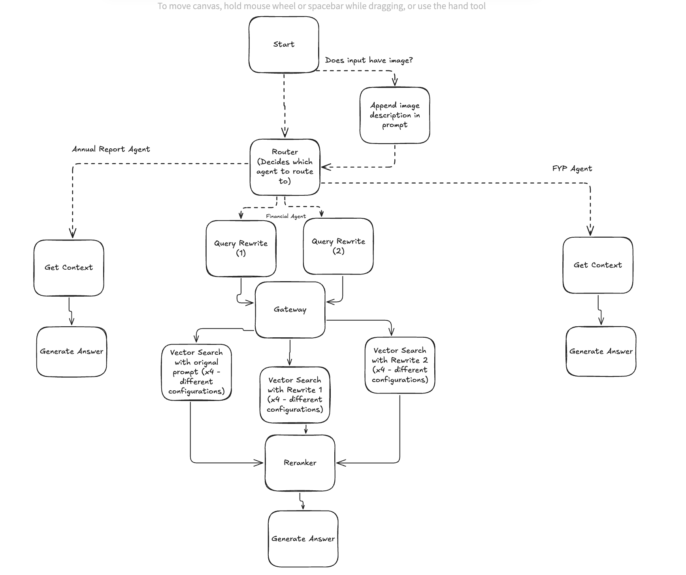

# Multimodal Agentic RAG

A sophisticated multimodal Agentic RAG-based chatbot built with LangGraph, leveraging Qdrant vector database, Google's Gemini, and OpenAI models.

## Overview

This project implements an advanced Retrieval-Augmented Generation (RAG) system with agentic capabilities and multimodal processing. The system can process both text and images, orchestrate multiple specialized agents, and generate precise responses by retrieving and reasoning over domain-specific knowledge.

## Architecture

### Data Ingestion

The system employs two main types of data ingestion pipelines located in the `data_ingestion` folder:

1. **Agentic Ingestion**
   - Uses vision models to annotate documents
   - Captures semantic structure and visual elements
   - Generates contextual metadata for improved retrieval

2. **Mistrial Data Pipeline**
   - Leverages Mistrial OCR to extract text from documents
   - Captures and processes embedded images
   - Uses Pixtrial 12B models to annotate and describe visual content
   - Preserves the relationship between text and visual elements

After extraction, the documents are processed through:
- Semantic chunking for meaningful document segmentation
- Hybrid embeddings generation using OpenAI embeddings and BM25 sparse vectors
- Storage in Qdrant vector database for efficient retrieval

### Agent Orchestration

The system follows a sophisticated orchestration workflow:

1. **Query Processing**
   - User submits a query, optionally with an image
   - If an image is included, its description is appended to the original query

2. **Router Agent**
   - Analyzes the query to determine the most appropriate specialized agent
   - Routes the query to one of three domain-specific agents:
     - FYP (Final Year Project) Assistant
     - Annual Report Assistant
     - Financial Assistant

3. **Specialized Agents**
   - Each agent has domain-specific knowledge and retrieval strategies
   - The Financial Agent is the most complex, implementing:
     - Query transformation for improved retrieval
     - RAG fusion techniques to combine multiple retrieval strategies

## Components

- **Frontend**: Streamlit interface for user interaction
- **Backend**: LangGraph-based agent system
- **Retrieval**: Qdrant vector database with hybrid search capabilities
- **Models**:
  - Gemini for multimodal reasoning
  - OpenAI for embeddings
  - Mistrial models for OCR and image annotation

## Data Sources

The system can process and answer questions about (All in data folder):
- Final Year Project Handbook
- Annual Reports
- Financial Documents

## Technical Implementation

The project is structured around several key components:
- Agent graphs defined using LangGraph
- Vector search optimized with hybrid dense-sparse embeddings
- Multimodal processing pipelines for text and images
- Context management for coherent conversations
- Advanced RAG techniques including reranking and fusion

## Getting Started

1. Clone the repository
2. Install dependencies with `pip install -r requirements.txt`
3. Set up environment variables for API keys
4. Run the application with `streamlit run app.py`
5. Or run it by: `python -m ai_backend.parent_graph`

## Requirements

- Python 3.12
- Access to OpenAI, Google Gemini, Mistrial, and Qdrant APIs
- Required packages listed in `requirements.txt`

## License

[Specify your license here]